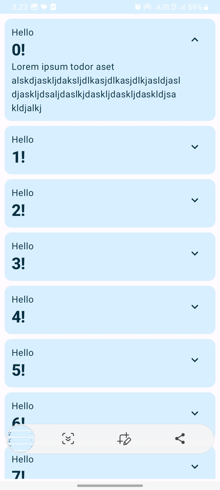

  
  <h3>Project when following 
    <a href="https://developer.android.com/codelabs/jetpack-compose-basics?hl=id&continue=https%3A%2F%2Fdeveloper.android.com%2Fcourses%2Fpathways%2Fjetpack-compose-for-android-developers-1%3Fhl%3Did%23codelab-https%3A%2F%2Fdeveloper.android.com%2Fcodelabs%2Fjetpack-compose-basics#13">
Build first app with Jetpack Compose at Google Developer {codelab}
    </a>
  </h3>

